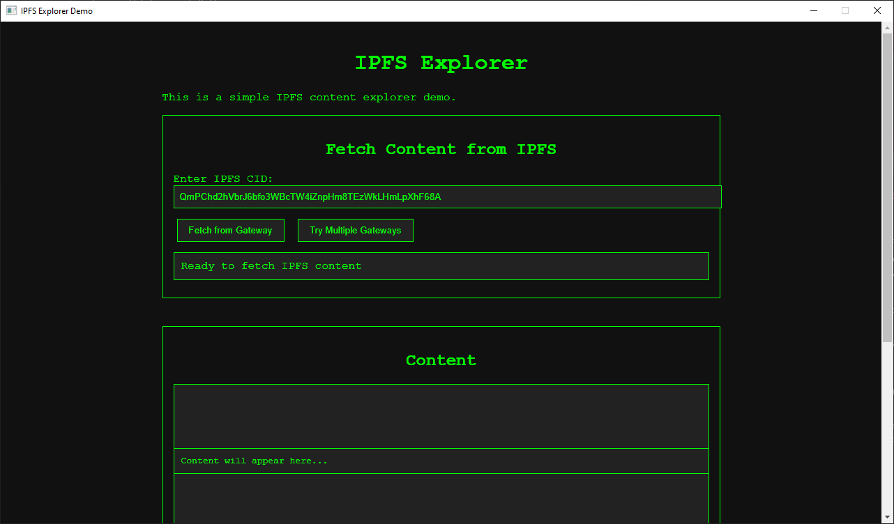

# IPFS Explorer Demo

A desktop application for exploring the InterPlanetary File System (IPFS) built with Python and PyQt6.

This shows you how to use IPFS without a local IPFS node to load and display IPFS content.



## Features

- Simple and clean interface
- WebView-based IPFS exploration
- Cross-platform compatibility

## Requirements

- Python 3.8+
- PyQt6
- PyQtWebEngine

## Installation

1. Clone this repository
2. Install the required packages:
   ```
   pip install -r requirements.txt
   ```

## Running the Application

```
python main.py
```

## Usage

The application will open a window with a web view that loads the IPFS interface from the `appdata/index.html` file.

## Project Structure

- `main.py`: Main application file that creates the window and loads the IPFS interface
- `appdata/`: Directory containing the HTML, CSS, and JavaScript files for the IPFS interface

## Note

This application includes special settings to enable IPFS functionality in the WebView, including:
- WebGL support
- Remote URL access
- Custom user agent for CORS handling 